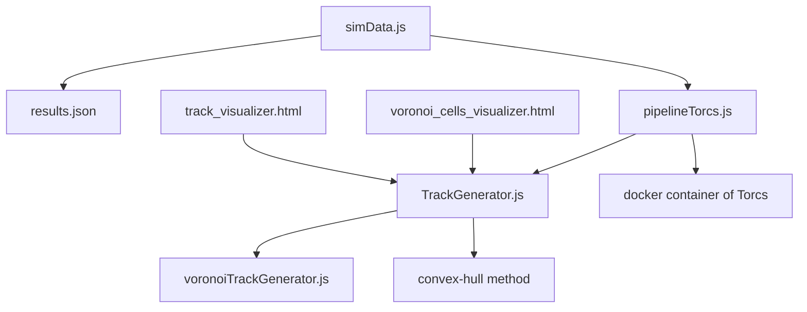

```mermaid
graph TD
    TrackGenerator["TrackGenerator.js"]
    pipelineTorcs["pipelineTorcs.js"]
    simData["simData.js"]
    trackVisualizer["track_visualizer.html"]
    voronoiCellsVisualizer["voronoi_cells_visualizer.html"]
    results["results.json"]
    docker["docker container of Torcs"]
    convex-hull["convex-hull method"]
    voronoi["voronoiTrackGenerator.js"]

    simData --> results
    simData --> pipelineTorcs
    pipelineTorcs --> TrackGenerator
    pipelineTorcs --> docker
    TrackGenerator --> voronoi
    voronoiCellsVisualizer --> TrackGenerator
    trackVisualizer --> TrackGenerator
    TrackGenerator --> convex-hull
```